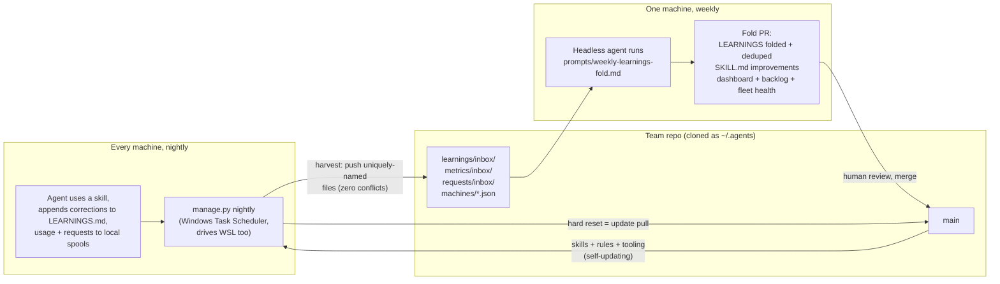

# agent-skills-manager

**Your team's coding agents, learning from each other's mistakes — automatically.**

Every developer using Cursor or Claude Code is quietly re-teaching their
agent the same lessons: the flag that changed, the internal proxy dance, the
deploy step everyone forgets. That knowledge evaporates at the end of each
session, on each machine, for each person.

This repo turns [Agent Skills](https://agentskills.io) into a **team
memory with a feedback loop**: skills are distributed to every machine
nightly, agents record what went wrong in the field, and a weekly reviewed
pull request folds those corrections back into the skills everyone runs
tomorrow. No servers, no telemetry infrastructure, no new tools — the entire
system is **git plus one scheduled task**.

## How it works



Three loops ride the same pipe:

- **Learnings** — after using a skill, agents append one dated correction
  line to its `LEARNINGS.md`. Nightly harvest ships them upstream; the
  weekly agent semantically dedupes across the team, and lessons confirmed
  by **two or more people** get folded into the skill itself — as separate,
  droppable commits in a PR a human reviews.
- **Metrics** — agents log each skill use to a local spool; the dashboard
  (`metrics/DASHBOARD.md`) shows adoption, corrected-rates, struggling
  skills, and deprecation candidates. The fleet heartbeats in
  `machines/*.json` flag broken installs nobody noticed.
- **Requests** — when an agent watches a user struggle at a task no skill
  covers, it logs the need. The weekly triage ranks `requests/BACKLOG.md`
  by distinct requesters: a demand-ranked backlog of skills worth writing,
  authored by the agents that saw the pain.

Contributing is a conversation: a teammate tells their agent
*"this should be a team skill"*, and `/propose-skill` interviews them,
scaffolds, validates, and opens the PR.

## Why this design holds up

- **Machines are appliances.** The repo is cloned directly as `~/.agents`
  (no symlinks — they need admin on Windows). Every night each clone pushes
  its sanctioned local writes upstream as *uniquely-named files* — zero
  merge conflicts at any fleet size — then hard-resets to `origin/main`.
  Harvest **is** the update pull; drift is structurally impossible.
- **The tooling ships inside the repo.** `manage.py` (single-file,
  stdlib-only, PEP 723) updates itself with every nightly pull. New
  features and dependencies reach the whole fleet without reinstalling
  anything.
- **One scheduled task, even with WSL.** cron inside WSL only fires while
  the VM is running. The Windows task syncs both sides
  (`wsl.exe -e bash -lc …`); a broken WSL never blocks the Windows night.
- **Improvement is gated, not automatic.** Agents may only append
  learnings; skills change through the weekly fold PR, with evidence in the
  description and one commit per fold so a reviewer can drop any single
  change.
- **Auth is one env var.** `AGENT_SKILLS_PAT` (Azure DevOps PAT, Code
  read & write) is sent as a per-invocation Basic auth header — never
  written to git config, remote URLs, or disk.

## Quick start (teammate, Windows)

Clone the repo **anywhere** — the clone is just how you obtain the script:

```powershell
git clone <repo-url> skills-setup; cd skills-setup
$env:AGENT_SKILLS_PAT = '<your ADO PAT: Code read & write>'
powershell -ExecutionPolicy Bypass -File bootstrap.ps1
```

Bootstrap fails early on missing env vars, installs git + uv (winget with
fallbacks), creates the managed clone at `%USERPROFILE%\.agents`, mirrors
everything into WSL if present, registers the nightly Scheduled Task, and
runs `manage.py doctor`. Idempotent — re-run any time; delete the setup
folder afterwards.

## Setting up for your team (maintainer, one-time)

1. Push this repo to your Azure DevOps project.
2. Distribute the quick-start above with your repo URL.
3. On the machine that will run the weekly fold, schedule your headless
   agent CLI against the committed prompt, e.g. weekly via Task Scheduler:

   ```powershell
   cd $HOME\.agents; agent -p (Get-Content prompts\weekly-learnings-fold.md -Raw)
   ```

   (Or set `AGENT_SKILLS_FOLD=1` / `bootstrap.ps1 -FoldMachine` on exactly
   one machine for the mechanical, no-LLM fallback: `manage.py fold`.)
4. Optional: set `TEAMS_WEBHOOK_URL` on the fold machine for a weekly
   digest that credits contributors whose lessons got promoted.
5. Recommended: branch policy requiring review on `learnings/fold` PRs.

Hosting elsewhere? Harvest works with any git remote; only the PR-creation
and auth-header helpers are Azure DevOps-specific (one small function each
to swap for GitHub/GitLab).

## Layout

```
skills/<name>/          one folder per skill: SKILL.md + LEARNINGS.md (+ scripts/, references/)
rules/                  always-on agent rules (the loop instructions live here)
prompts/                versioned prompts for scheduled agent jobs
learnings/inbox/        harvested corrections awaiting the weekly fold
metrics/inbox/ + DASHBOARD.md    usage telemetry and the weekly dashboard
requests/inbox/ + BACKLOG.md     demand-ranked backlog of skills to build
machines/               per-machine heartbeats (fleet health)
manage.py               nightly sync/harvest/fold engine (self-updating)
bootstrap.ps1           one-time Windows machine setup
AGENTS.md               rules for agents working inside this repo
ROADMAP.md              where this goes: evals, drift detection, multi-team scale
```

`manage.py doctor` verifies any machine; `.manager/` holds local logs,
backups, and spools (gitignored).

## The conventions that make it work

Every skill follows the house process in `skills/agent-create-skill`
(interview → scaffold → validate → trigger-test → learnings loop), and two
always-on rules close the loop: `rules/skills-first.md` (check skills before
improvising; read LEARNINGS before executing) and `rules/team-loop.md`
(record corrections, usage, and unmet needs in the sanctioned paths).
Nothing else about a machine is trusted or preserved — which is exactly why
the system stays healthy with zero ongoing administration.
