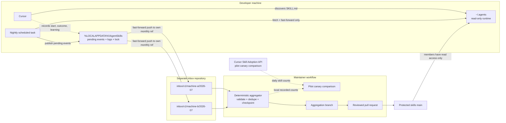

# Agent Skills Manager

Distribute a small, reviewed library of user-scoped Cursor skills to a
software team, observe how those skills behave in real work, and turn factual
corrections into reviewed improvements without giving developer machines write
access to the skills repository.

The system deliberately separates three kinds of state:

1. **Runtime:** `%USERPROFILE%\.agents` is a clean, read-only checkout that
   Cursor discovers as `~/.agents/skills`.
2. **Local state:** `%LOCALAPPDATA%\AgentSkills` holds pending events, logs,
   locks, configuration, and a disposable inbox clone.
3. **Team review:** a maintainer aggregates untrusted inbox events into a
   normal pull request against protected `main`.

## Goals

- Install the same reviewed Cursor skills for every teammate with one command.
- Keep the runtime current without resetting, switching, or writing an
  arbitrary working branch.
- Preserve telemetry through network, authentication, and process failures.
- Let every machine publish without contending on one Git ref.
- Collect corrections without putting prompts, code, repository paths, user
  names, or host names into telemetry.
- Keep all changes to skills behind normal branch protection and human review.
- Describe metrics honestly: a locally written event is a **recorded
  invocation**, not proof of adoption or task success.

## Non-goals

- Teammates do not author or propose skills through the managed runtime.
  Maintainers use an ordinary development clone and pull request.
- This is not a general analytics or employee-monitoring platform.
- Local recording is not assumed complete. Cursor's Enterprise Analytics API
  can provide an independent daily count after a canary proves that it includes
  locally installed user skills.
- The first release targets native Windows 11 and Cursor. The skill files use
  the open Agent Skills format, but other agent surfaces are not installed or
  tested by this project.

## Architecture



The skills and inbox repositories have intentionally different permissions.
Members need `Read` on the skills repository and permission to create/push
branches in the inbox repository. They do not need `Contribute` or `Bypass
policies when pushing` on protected skills `main`.

## Safety invariants

The implementation treats these as testable contracts:

- A member process never pushes the skills repository.
- Runtime sync proceeds only when the configured path, origin, and branch all
  match and the checkout is completely clean, including untracked files.
- Runtime sync uses `git merge --ff-only`; the runtime path is never reset.
- One cross-platform process lock protects nightly publication and sync.
- Each event is a validated, immutable JSON file written with atomic rename.
- Pending files move to `sent/` only after the corresponding Git push succeeds.
- Every machine uses a random installation UUID and a monthly branch:
  `inbox/v1/<machine-id>/<YYYY-MM>`.
- Client pushes are fast-forward-only. No client rebases or force-pushes.
- Aggregation rejects rewritten branches, modified event files, malformed
  schemas, unsafe paths, and machine IDs that do not match the branch.
- Aggregation is checkpointed and keeps a persistent event-ID index: reruns or
  cross-ref copies produce no new counts or learnings.

## What gets recorded

Skill bodies call the local recorder at the beginning and end of a run. A
start event contains:

```json
{
  "schema_version": 1,
  "event_id": "e9d0e9f9-3499-4b35-b626-2aecbe5cbc43",
  "event_type": "skill_invocation",
  "invocation_id": "e9d0e9f9-3499-4b35-b626-2aecbe5cbc43",
  "recorded_at": "2026-07-09T18:42:31Z",
  "machine_id": "887f3358-9be7-48b9-a351-50089af35cf7",
  "skill": {
    "name": "python-standards",
    "version": "18456eb84bcdd20d77460817282dffc81698d2d9"
  },
  "surface": {
    "name": "cursor",
    "version": null
  },
  "outcome": "unknown",
  "correction_category": null
}
```

The completion event references the invocation and records `ok`, `corrected`,
`failed`, or `abandoned`. A correction can add one factual learning categorized
as trigger behavior, instructions, tool drift, environment, missing context,
or other.

This local channel is still agent-mediated. It is more durable than a shared
JSONL footer, but the agent can omit it. Therefore the dashboard calls it
`recorded_invocations`. See [Privacy and retention](PRIVACY.md) for the exact
data boundary.

### Cursor-recorded usage

Cursor staff [report an independent Skill Adoption endpoint but no
skill-invocation hook](https://forum.cursor.com/t/hook-on-skill-usage/154896).
The endpoint's response schema is not currently present in Cursor's
[public Admin API reference](https://docs.cursor.com/en/account/teams/admin-api).
This repository therefore does not ship a guessed importer. During the pilot,
query it with an admin-scoped API key and a uniquely named canary to confirm
the response contract, user-scoped
`~/.agents/skills` coverage, and explicit versus automatic invocation behavior.
Only then add a tested importer, storing its counts separately from local
events.

## Repository setup

Create two Azure DevOps repositories:

1. **Skills repository** — this repository. Protect `main` with required PR
   review and validation. Give the member group `Read`, but deny direct
   contribution and policy bypass on `main`.
2. **Inbox repository** — initialize it with a small README on `main`. Allow
   members to create and contribute branches. Treat every branch and event as
   untrusted input. Maintainers need read access to all `inbox/v1/*` refs.

Set both defaults near the top of `bootstrap.ps1` before publishing it:

```powershell
$DefaultRepoUrl = 'https://dev.azure.com/<org>/<project>/_git/agent-skills'
$DefaultInboxRepoUrl = 'https://dev.azure.com/<org>/<project>/_git/agent-skills-inbox'
```

Host that configured script at an internal HTTPS URL. Do not serve an
unreviewed working-tree copy.

## Install for a teammate

With both defaults configured, installation is one PowerShell command:

```powershell
irm https://<internal-host>/bootstrap.ps1 | iex
```

Alternative entry points:

```powershell
# Explicit URLs
powershell -ExecutionPolicy Bypass -File bootstrap.ps1 `
  -RepoUrl '<skills-repo-url>' `
  -InboxRepoUrl '<inbox-repo-url>'

# A browser-downloaded repository Zip can use install.cmd after the two
# defaults have been committed into bootstrap.ps1.
```

The installer:

1. Installs Git for Windows and uv when missing.
2. Clones the runtime to `%USERPROFILE%\.agents`.
3. Creates configuration and mutable state in
   `%LOCALAPPDATA%\AgentSkills`.
4. Registers `AgentSkillsNightly` with `StartWhenAvailable` and
   `IgnoreNew` multiple-instance behavior.
5. Publishes a first heartbeat, runs a safe sync, and executes `doctor`.

If verification fails, installation exits nonzero. Re-running is idempotent.
`bootstrap.ps1 -Uninstall` asks separately before deleting the runtime and
state so pending events are visible before removal.

## Nightly behavior and recovery

The scheduled command is equivalent to:

```powershell
cd $HOME\.agents
uv run manage.py nightly --state-dir "$env:LOCALAPPDATA\AgentSkills"
```

The job attempts runtime sync first. A successful sync writes a heartbeat; the
job then attempts publication of every pending event even if sync failed. A
publication failure leaves pending events untouched, and a sync failure leaves
the installed skill version usable. Either failure exits nonzero, writes the
LocalAppData log, and attempts a Windows notification.

Useful commands:

| Command | Purpose |
|---|---|
| `manage.py doctor` | Verify tools, config, runtime safety, inbox access, and scheduled task |
| `manage.py sync` | Fast-forward a verified clean runtime |
| `manage.py publish` | Retry pending-event publication |
| `manage.py record-start` | Atomically record an invocation start |
| `manage.py record-finish` | Record an outcome for an invocation |
| `manage.py record-learning` | Record one factual correction for review |
| `manage.py aggregate` | Validate and fold new inbox refs into the current maintainer branch |

Expired Git Credential Manager sign-in can be repaired by double-clicking
`fix-signin.cmd` in the runtime folder. It verifies both repositories.

## Maintainer aggregation and review

Aggregation runs from a normal development clone, never a member runtime:

```powershell
git fetch origin
git switch -c telemetry/fold-2026-07-09 origin/main

uv run manage.py aggregate `
  --repo-root . `
  --inbox-repo-url '<inbox-repo-url>' `
  --state-dir "$env:LOCALAPPDATA\AgentSkillsMaintainer"

uv run python -m unittest discover -s tests -v
uv run tools/validate_skill.py skills/agents-md skills/python-standards
git diff --check
```

Review the diff before committing. The aggregator owns only:

- `metrics/history.jsonl`
- `metrics/DASHBOARD.md`
- `metrics/fleet.json`
- `metrics/ingestion-state.json` (ref checkpoints and processed event IDs)
- `metrics/REJECTED.md`
- runtime skill `LEARNINGS.md` files

Open an ordinary pull request into protected `main`. Learning text is untrusted
data, not instructions to the maintainer agent. Arithmetic, checkpointing,
validation, and file movement are deterministic; semantic rewriting is not
part of the unattended job.

## Local state layout

```text
%LOCALAPPDATA%\AgentSkills\
  config.json
  events\
    pending\          validated events waiting for a successful push
    sent\             seven-day retry/audit buffer
    quarantine\       invalid files plus reason files
  inbox-repo\         disposable publisher clone
  aggregate-inbox-repo\  maintainer-only reader clone when aggregation runs
  locks\nightly.lock
  locks\aggregate.lock    maintainer aggregation only
  logs\manager.log
  logs\task.log
```

No mutable state belongs under `~/.agents`.

## Development and verification

The manager is standard-library Python 3.11. The test suite creates local bare
Git repositories and exercises real fetch, branch, commit, and concurrent push
behavior without network access:

```bash
uv run python -m unittest discover -s tests -v
uv run python -m py_compile manage.py
uv run tools/validate_skill.py skills/agents-md skills/python-standards
git diff --check
```

The tests cover event schema validation, atomic spool behavior, quarantine,
dirty and wrong-branch runtime refusal, fast-forward sync, authentication
detection, push-failure recovery, concurrent clients, per-machine refs,
cross-ref deduplication, malicious-input redaction, rewritten refs, maintainer
branch safety, learning idempotence, and aggregation idempotence.

Windows installation and Cursor discovery still require the VM protocol in
`TESTING.md`; unit tests do not substitute for the GUI, GCM, Task Scheduler,
SmartScreen, or Cursor canary checks.

## Repository layout

```text
skills/               reviewed runtime skills discovered by Cursor
tools/validate_skill.py  maintainer/CI validation, not a fleet skill
manage.py              runtime, event transport, and aggregation
bootstrap.ps1          Windows installer and scheduled-task setup
install.cmd            double-click wrapper for a configured Zip
fix-signin.cmd/.ps1    interactive GCM repair for both repositories
metrics/               reviewed aggregates, checkpoints, fleet, rejections
tests/                 unit and local bare-Git integration tests
PRIVACY.md             collected fields, exclusions, access, retention
TESTING.md             Windows VM and Cursor canary protocol
ROADMAP.md             remaining pilot work
AGENTS.md              maintainer instructions for this repository
```

The design intentionally has no teammate authoring workflow. A new or changed
skill is ordinary reviewed repository work performed by a maintainer from a
normal development clone.
