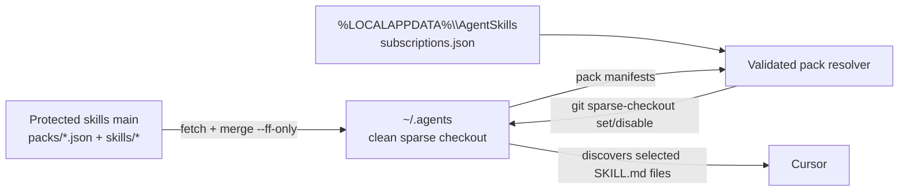

# Skill packs implementation plan

## Status and decision summary

This document is the implementation plan for adding user-selected skill packs
to the existing global Cursor skill runtime.

The following product and architecture decisions are settled:

- Keep one protected skills repository and one clean runtime checkout on its
  configured branch.
- Use Git cone-mode sparse checkout to make only subscribed skill directories
  visible under `~/.agents/skills`.
- Store subscription preferences under `%LOCALAPPDATA%\AgentSkills`, never in
  the runtime checkout.
- Treat `all` as a reserved subscription mode that receives every current and
  future skill.
- Provide static, reviewed install links for `all` and individual packs.
- Do not build an interactive pack chooser.
- Keep the existing canonical `bootstrap.ps1`; pack-specific installers are
  small wrappers that pass an initial selection to it.
- Apply an install link's selection only to a fresh installation. Re-running
  any installer preserves an existing subscription.
- Do not record pack subscriptions in telemetry.

## Goals

- Let a new user install all skills or a named pack with one copy-and-paste
  command.
- Let an existing user subscribe to and unsubscribe from packs locally.
- Keep Cursor's discovery path unchanged: selected skills remain ordinary
  directories under `~/.agents/skills`.
- Preserve the current runtime invariants: correct path, origin, and branch;
  clean worktree; fetch plus fast-forward only; no reset, branch switching,
  rebase, or push to the skills repository.
- Automatically reconcile a subscribed pack when reviewed membership changes
  land on the configured runtime branch.
- Make every pack definition, installer entry point, and membership change
  reviewable in the skills repository.
- Preserve the current all-skills behavior for every existing installation.

## Non-goals

- Packs are not an authorization or licensing boundary. A user with read access
  to the repository can inspect every Git object and can choose `all`.
- Packs do not create separate release channels or branches.
- Packs do not support teammate-authored skills, external skill sources, or
  arbitrary repository URLs.
- Pack selection is user-scoped, not repository-scoped and not centrally
  enforced.
- Version 1 does not support packs containing other packs.
- Version 1 does not install a user-facing GUI or interactive terminal chooser.
- Version 1 does not add pack selections to heartbeat, invocation, fleet, or
  dashboard schemas.
- Sparse checkout is intended to reduce discovery and routing noise. It is not
  expected to materially reduce clone size or network transfer.

## Target architecture



The runtime continues to contain the root management scripts. In pack mode,
the working tree also contains `packs/` and only the selected
`skills/<name>/` directories. Cone mode keeps root files such as `manage.py`,
`bootstrap.ps1`, and `fix-signin.ps1` present without listing them as sparse
directories.

## Repository layout

Add these reviewed files:

```text
packs/
  agents.json
  python.json
installers/
  all.ps1
  agents.ps1
  python.ps1
tools/
  validate_packs.py
SKILLS-PACK.md
```

`installers/` contains only static entry points that select a pack. It does not
contain copies of the canonical bootstrap implementation.

The initial pack taxonomy should be small. With the current skills, a sensible
starting point is:

| Pack | Initial skills |
|---|---|
| `agents` | `agents-md` |
| `python` | `python-standards` |
| `all` | Reserved mode; all skills, not a manifest |

Pack taxonomy and membership are product decisions made in reviewed pull
requests. Adding a skill requires assigning it to at least one active pack.

## Pack manifest schema

Each `packs/<name>.json` file has this exact version 1 shape:

```json
{
  "schema_version": 1,
  "name": "python",
  "display_name": "Python Development",
  "description": "Standards and workflows for Python repositories.",
  "status": "active",
  "replaced_by": null,
  "skills": [
    "python-standards"
  ]
}
```

Validation rules:

- Reject unknown or missing keys.
- Require `schema_version` to equal `1`.
- Require `name` to match both the safe skill-name pattern and the manifest
  filename.
- Reserve `all`; no `packs/all.json` may exist.
- Require a short nonempty `display_name` and `description`.
- Allow `status` values `active` and `deprecated` only.
- Require `replaced_by` to be `null` for an active pack.
- If a deprecated pack names a replacement, require that replacement to exist
  and be active.
- Require `skills` to be a sorted list of unique safe skill names.
- Require every referenced `skills/<name>/SKILL.md` to exist.
- Require every repository skill to appear in at least one active pack.
- Allow a skill to appear in multiple packs. Resolution uses a set union.
- Reject active empty packs. A deprecated pack may remain empty as a permanent
  compatibility tombstone.

Published pack identifiers are permanent. Rename by adding a new pack,
deprecating the old pack, and retaining the old manifest. Do not delete old
pack identifiers because subscription state is deliberately not collected and
the fleet cannot prove that no machine still references one.

Pack manifests are data, never commands. They cannot contain URLs, hooks,
scripts, include paths, or executable fragments.

## Local subscription schema

Add this mutable file:

```text
%LOCALAPPDATA%\AgentSkills\subscriptions.json
```

All-skills mode:

```json
{
  "schema_version": 1,
  "mode": "all",
  "packs": []
}
```

Pack mode:

```json
{
  "schema_version": 1,
  "mode": "packs",
  "packs": ["agents", "python"]
}
```

Rules:

- A missing file means `all`. This is the complete migration path for current
  installations and avoids changing `config.json` version 1.
- Reject unknown keys and schema versions.
- Allow `mode` values `all` and `packs` only.
- Require `packs` to be empty in `all` mode.
- Require `packs` to be a sorted list of unique safe names in pack mode.
- An empty pack list is valid and means that no runtime skills are selected.
- Write the file atomically using the manager's existing JSON writer.
- Treat this file as desired state. If projection fails after a subscription
  command, keep the desired selection and retry reconciliation on the next
  manual or nightly sync.

Add `StatePaths.subscriptions` rather than folding subscriptions into
`ManagerConfig`. Repository/authentication configuration and user preference
then retain independent schemas and lifecycles.

## Pack resolution

Add standard-library-only types and functions to `manage.py`:

```text
PackManifest
SubscriptionConfig
load_pack_catalog(runtime)
validate_pack_catalog(runtime, catalog)
load_subscriptions(paths)
save_subscriptions(paths, subscriptions)
resolve_subscribed_skills(catalog, subscriptions)
current_sparse_directories(runtime)
reconcile_skill_projection(config, paths)
verify_skill_projection(config, paths)
```

Resolution behavior:

1. Load and validate every tracked `packs/*.json` manifest.
2. Load `subscriptions.json`, treating absence as `all`.
3. In `all` mode, return all repository skill names and request that sparse
   checkout be disabled.
4. In pack mode, reject unknown packs and new subscriptions to deprecated
   packs. Existing deprecated subscriptions continue resolving but emit a
   warning with the replacement, if any.
5. Union and sort every selected pack's skills.
6. Produce the exact sparse directory list: `packs` plus one
   `skills/<name>` entry per resolved skill.

All path fragments must come from already validated identifiers. Pass sparse
paths on standard input rather than interpolating them into a shell command or
constructing one command per skill.

## Sparse-checkout projection

For pack mode, reconcile with:

```text
git sparse-checkout set --cone --stdin
```

For all mode, reconcile with:

```text
git sparse-checkout disable
```

Do not use manual deletion, copying, junctions, symbolic links, `git read-tree`,
or direct writes to `.git/info/sparse-checkout`.

Reconciliation must run under the existing `nightly.lock` and follow these
steps:

1. Validate the runtime path, origin, branch, and clean worktree.
2. Resolve desired subscription state against the checked-out catalog.
3. Apply the sparse-checkout command.
4. Re-run the clean-worktree validation.
5. Enumerate physical `skills/*/SKILL.md` files.
6. Compare the physical inventory with the resolved inventory exactly.
7. Report the current mode, subscribed packs, and number of visible skills.

Git's sparse configuration is operational runtime metadata. The canonical
selection remains `subscriptions.json`; manually edited sparse patterns are
drift. `doctor` must report drift, and successful reconciliation may restore
the desired patterns after the normal dirty-worktree safety check passes.

Never remove or overwrite an untracked or modified file while reconciling. The
existing porcelain status check must run before any sparse command and block
the operation when the checkout is dirty.

## Nightly sync behavior

Change the successful runtime-sync transaction to:

1. Load manager and subscription configuration.
2. Acquire `nightly.lock`.
3. Validate base runtime safety.
4. Fetch `origin`.
5. Verify the configured remote branch and divergence.
6. Refuse local commits as today.
7. Merge the remote branch with `--ff-only` when behind.
8. Load the now-current pack catalog.
9. Reconcile and verify the skill projection.
10. Write a heartbeat only after both fast-forward and projection succeed.
11. Attempt pending-event publication even if sync or projection failed, as
    today.

If the updated catalog is invalid or no longer resolves a subscribed pack,
fail closed:

- Keep the existing sparse selection.
- Do not fall back to `all`.
- Do not fall back to an empty selection.
- Do not emit a healthy heartbeat.
- Continue the independent pending-event publication attempt.
- Log and notify with the missing or invalid pack name.

A fast-forward can update `manage.py` while the already-running Python process
continues using its previously loaded code. Therefore any future pack-manifest
schema change requires a two-release protocol:

1. Release manager code that understands both the old and new schema.
2. After that version has had time to reach the fleet, release manifests using
   the new schema.

Never change manager parsing and require the new manifest schema in the same
commit.

## User commands

Add a `packs` command group:

```powershell
uv run "$HOME\.agents\manage.py" packs list
uv run "$HOME\.agents\manage.py" packs current
uv run "$HOME\.agents\manage.py" packs subscribe python
uv run "$HOME\.agents\manage.py" packs unsubscribe python
uv run "$HOME\.agents\manage.py" packs set agents python
uv run "$HOME\.agents\manage.py" packs all
uv run "$HOME\.agents\manage.py" packs none
```

Command semantics:

- `list`: show active and deprecated packs, descriptions, skill counts, and a
  selected marker. It does not mutate state.
- `current`: show mode, pack names, resolved skills, and any drift between
  desired and physical state.
- `subscribe`: switch from `all` to pack mode if necessary, add the named
  packs, save desired state, and reconcile immediately.
- `unsubscribe`: remove named packs and reconcile. Removing the last pack
  results in an explicit empty selection, not `all`.
- `set`: replace the current pack list exactly and reconcile.
- `all`: select all current and future skills and disable sparse checkout.
- `none`: select pack mode with an empty list and reconcile.

All mutating commands acquire `nightly.lock`. They validate all arguments and
the catalog before saving desired state. If projection subsequently fails,
exit nonzero and state clearly that the preference was saved but is not yet
fully applied.

Add a root `packs.cmd` wrapper so the normal Windows command is shorter:

```powershell
~\.agents\packs.cmd subscribe python
~\.agents\packs.cmd all
```

The wrapper should only locate `uv` and invoke the runtime's `manage.py packs`
command. Keep it ASCII and non-interactive.

## Initial installation and custom links

### Canonical bootstrap interface

Extend `bootstrap.ps1` with mutually exclusive parameters:

```powershell
[string[]]$InitialPacks = @()
[switch]$AllSkills
```

There is deliberately no `ChoosePacks` parameter and no menu.

Fresh-install selection precedence:

1. `-AllSkills` selects `all`.
2. `-InitialPacks` selects exactly those packs.
3. With neither argument, default to `all`.

Passing both arguments is an error. Validate pack names only after the runtime
has been cloned or fetched and the reviewed manifests are locally available.

### Static install entry points

Keep `bootstrap.ps1` canonical and add small reviewed wrappers. For example,
`installers/python.ps1` should be equivalent to:

```powershell
$bootstrap = [ScriptBlock]::Create(
    (Invoke-RestMethod 'https://<internal-host>/bootstrap.ps1')
)
& $bootstrap -InitialPacks 'python'
```

`installers/all.ps1` invokes the canonical script with `-AllSkills`.

Publish stable URLs such as:

```powershell
irm https://<internal-host>/install/all.ps1 | iex
irm https://<internal-host>/install/python.ps1 | iex
irm https://<internal-host>/install/agents.ps1 | iex
```

Do not dynamically generate executable PowerShell from a `?packs=` query
parameter. Static wrappers keep every executable input reviewed, validateable,
cacheable, and reproducible.

The wrapper files must stay ASCII for Windows PowerShell 5.1. CI validates that
each filename and `-InitialPacks` value names an active reviewed pack and that
an `all.ps1` wrapper exists.

### Idempotent reruns

Installer selection is initial state, not an ongoing override.

Before applying `AllSkills` or `InitialPacks`, determine whether this is a fresh
installation from the absence of the existing manager configuration. If the
machine is already configured:

- Preserve its current subscription, including the implicit `all` state of a
  pre-pack installation.
- Do not create or replace `subscriptions.json` from installer parameters.
- Print the effective current selection.
- Direct the user to `~\.agents\packs.cmd` to make changes.

This rule applies even when a user installs with a different pack-specific URL
than the original one. Re-running installation remains a repair/idempotence
operation and never becomes a hidden subscription mutation.

### Installation sequence

The new sequence is:

1. Install dependencies.
2. Resolve and authenticate to both repositories.
3. Determine whether manager configuration already exists.
4. Clone or verify the runtime.
5. Fetch the protected runtime branch.
6. Configure isolated local state while preserving the machine ID.
7. On a fresh install, write the requested initial subscription.
8. Reconcile sparse checkout.
9. Register the nightly task.
10. Run nightly and `doctor`.
11. Print the installed packs, visible skill count, and change command.

The success banner must name the effective selection. It must not claim that a
requested pack was installed when an existing subscription was preserved.

## Telemetry and privacy

Do not change event or heartbeat schemas for version 1 of packs.

- Invocation events already prove that a physically installed skill existed at
  the runtime commit recorded by the event.
- Recorded invocations remain a lower-bound signal and are not adoption.
- The manager does not publish `subscriptions.json`, pack names, or a complete
  installed-skill inventory.
- `PRIVACY.md` needs a clarifying sentence that subscription preferences remain
  local and are not transmitted, but its collection schema does not expand.
- Pack popularity cannot be calculated from current telemetry. Do not infer it
  from invocations.

If pack-level fleet reporting is later proposed, treat it as a separate privacy
and telemetry design requiring schema validation, tests, retention analysis,
dashboard wording, and review in the same change.

## Failure handling

| Failure | Required result |
|---|---|
| Unknown pack at install | Installation fails before changing subscription state |
| Unknown pack in local state | Preserve projection, fail sync, publish pending events |
| Invalid reviewed manifest | Preserve projection, fail sync, no healthy heartbeat |
| Dirty runtime | Refuse sparse changes and preserve every file |
| Wrong runtime branch/origin | Refuse sync and projection |
| Sparse command failure | Keep desired subscription for retry; report partial application |
| Projection inventory mismatch | Fail `doctor` and nightly health |
| Network failure before fetch | Leave installed skills usable |
| Pack removed from manifest | Treat as unresolved; never silently select all or none |
| Concurrent subscribe/nightly | One process owns `nightly.lock`; the other exits safely |
| Existing install uses pack link | Preserve existing subscription |

## Validation tooling

Add `tools/validate_packs.py` as a standard-library PEP 723 script. It validates
the complete catalog rather than one manifest in isolation because orphaned
skills and replacement targets are cross-file properties.

Suggested command:

```bash
uv run tools/validate_packs.py --repo-root .
```

It must emit deterministic, path-specific errors and exit nonzero for any
schema, membership, lifecycle, or installer-wrapper problem.

Keep `tools/validate_skill.py` responsible for individual skill correctness.
The standard repository verification becomes:

```bash
uv run python -m unittest discover -s tests -v
uv run python -m py_compile manage.py
uv run tools/validate_skill.py skills/agents-md skills/python-standards
uv run tools/validate_packs.py --repo-root .
git diff --check
```

## Automated test plan

### Manifest and subscription unit tests

- Valid active and deprecated manifests.
- Unknown, missing, or incorrectly typed keys.
- Unsafe names, filename mismatch, and reserved `all`.
- Missing, duplicate, unsorted, or unsafe skill references.
- Missing replacement, replacement to deprecated pack, and replacement cycles.
- Orphaned repository skill.
- Duplicate membership across packs resolves once.
- Missing `subscriptions.json` resolves to `all`.
- Valid all, multiple-pack, and empty-pack selections.
- Unknown schema, mode, pack, and malformed JSON.
- Atomic subscription writes preserve the old file on injected failure.

### Real-Git integration tests

Use the existing local bare-repository fixtures to prove:

- A full checkout switches to one pack and remains clean.
- Multiple packs produce the exact union of skill directories.
- Switching back to `all` disables sparse checkout and restores all skills.
- `none` leaves no `skills/*/SKILL.md` files while retaining manager and pack
  catalog files.
- A new skill added to a subscribed pack appears after fast-forward.
- A skill removed from a subscribed pack disappears after fast-forward.
- A skill in an unsubscribed pack remains absent after unrelated updates.
- Wrong branch, wrong origin, dirty tracked files, untracked files, and local
  commits block reconciliation without deleting data.
- Manually drifted sparse patterns are detected and safely reconciled only
  when the worktree is otherwise clean.
- A malformed catalog arriving by fast-forward preserves the prior physical
  projection and prevents a healthy heartbeat.
- `record-start` succeeds for a selected skill and rejects an uninstalled one.
- Concurrent nightly and pack mutation commands serialize through one lock.
- Publication still runs when projection fails.
- Installer reruns retain machine ID, task identity, pending events, and the
  existing subscription.

### CLI tests

- `packs list` and `packs current` are deterministic.
- Every mutating command is idempotent.
- Deprecated packs warn for existing subscribers and reject new subscriptions.
- `subscribe` from all mode switches to exactly the named pack selection rather
  than retaining an implicit all subscription.
- `unsubscribe` of the last pack results in none.
- Conflicting bootstrap arguments exit nonzero before reporting success.

## Windows 11 and Cursor canary

Changes to bootstrap, filesystem projection, and Cursor discovery require the
full protocol in `TESTING.md`. Add pack-specific cases and record dated results.

Required installation runs:

- Fresh `all.ps1` install as a standard user.
- Fresh pack-specific install as a standard user.
- Fresh canonical bootstrap with no selection arguments; verify all.
- Pack-specific install with a nonexistent pack; verify actionable failure.
- Immediate rerun of the same pack link.
- Rerun with a different pack link; verify the original selection is preserved.
- Repair rerun with pending events; verify no event loss.

Required Cursor observations:

- Only subscribed skills appear in Settings and the slash menu.
- An unselected skill cannot trigger automatically.
- Switching subscriptions adds and removes the expected skills.
- Determine whether Cursor needs a window reload, restart, or new conversation
  to refresh discovery; print the verified instruction from pack commands.
- `all` restores every reviewed skill.
- Runtime remains clean on `main` after every transition.
- Selected skills still record start, finish, and learning events.

Required scheduler observations:

- Nightly applies reviewed membership additions and removals.
- Offline users keep their last successfully projected skill set.
- Invalid pack state produces a nonzero task result and local notification.
- Concurrent manual subscription and scheduled nightly execution cannot leave
  a partial or dirty checkout.

## Documentation changes during implementation

Update these files in the same implementation series:

- `README.md`: architecture, install links, commands, state layout, nightly
  behavior, and pack lifecycle.
- `ROADMAP.md`: mark packs as implemented only after automated tests and the
  Windows/Cursor canary pass; distinguish local subscriptions from deferred
  multi-team overlays and company catalogs.
- `TESTING.md`: add the pack installation, sparse projection, rerun, and Cursor
  discovery matrix with dated results.
- `PRIVACY.md`: state explicitly that subscriptions remain local and are not
  published.
- `AGENTS.md`: add pack/catalog validation to required verification and protect
  the sparse-checkout safety rules.

Do not describe custom links or pack selection as built until their code and
acceptance tests exist.

## Delivery phases

### Phase 1: catalog and validation

- Add version 1 manifests for every existing skill.
- Add the complete-catalog validator and tests.
- Add lifecycle and membership documentation.
- Keep runtime behavior unchanged.

Exit criterion: every skill is valid and assigned to an active pack; invalid
catalog changes fail automated validation.

### Phase 2: local state, resolver, and CLI reads

- Add subscription paths, schema, parser, and resolver.
- Treat missing state as all.
- Implement `packs list` and `packs current` without projection changes.
- Add unit tests and explicit no-telemetry assertions.

Exit criterion: existing installs resolve deterministically to all and no
runtime behavior has changed.

### Phase 3: sparse projection and mutation commands

- Implement sparse reconciliation and exact inventory verification.
- Integrate reconciliation into sync, nightly health, and `doctor`.
- Add mutating pack commands and `packs.cmd`.
- Add real-Git safety, drift, failure, and concurrency tests.

Exit criterion: all automated cases pass and every projection transition leaves
the runtime clean and fast-forwardable.

### Phase 4: installation links

- Add `AllSkills` and `InitialPacks` bootstrap arguments.
- Add fresh-install detection and preserve-on-rerun behavior.
- Add reviewed static wrappers for all active packs and `all`.
- Validate wrapper-to-pack mappings.
- Update success and recovery messages.

Exit criterion: local scripted tests prove deterministic initial selection and
idempotent reruns.

### Phase 5: Windows/Cursor canary and documentation

- Execute every required standard-user, scheduler, GCM, and Cursor case.
- Record exact Cursor refresh behavior.
- Fix any discovered installer or discovery issues.
- Align README, roadmap, privacy, testing, and maintainer instructions.

Exit criterion: the dated canary results establish that selected skills alone
are discoverable and the existing runtime and telemetry guarantees still hold.

## Final acceptance criteria

- A fresh all-skills URL installs every current skill without prompting.
- A fresh pack URL installs exactly that pack without prompting.
- The canonical bootstrap with no pack argument remains backward-compatible and
  installs all skills.
- Installer reruns never replace an existing subscription.
- Users can change subscriptions with one local command.
- Cursor sees exactly the resolved skill set after the documented refresh step.
- A subscribed pack automatically receives reviewed membership changes.
- `git status --porcelain --untracked-files=all` remains empty after install,
  subscription changes, and nightly sync.
- Runtime sync remains fetch plus `merge --ff-only` on the configured branch.
- Dirty files, local commits, wrong branches, and wrong origins are preserved
  and block mutation.
- No client code pushes, resets, rebases, force-pushes, or switches the skills
  repository branch.
- Pack manifests and static installer wrappers are validated and reviewed.
- Existing installations migrate implicitly to all without changing machine ID,
  scheduled task, pending events, or telemetry.
- Pack subscription state never leaves LocalAppData.
- All automated verification passes and the Windows/Cursor results are recorded
  before the feature is called implemented.
